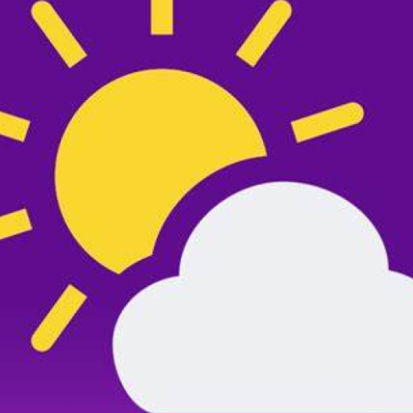

# fdroid
This repository hosts an [F-Droid](https://f-droid.org/) repo for apps from me and others. This allows you to install and update apps very easily.

### Apps
<!-- This table is auto-generated. Do not edit -->
| Icon | Name | Description | Version |
| --- | --- | --- | --- |
| <a href="https://github.com/FreetimeMaker/All-Miner"></a> | **[All Miner](https://github.com/FreetimeMaker/All-Miner)** | Efficient Android crypto miner with RandomX support. | 1.3.6 (11) |
| <a href="https://github.com/FreetimeMaker/Dualist"></a> | **[Dualist](https://github.com/FreetimeMaker/Dualist)** | Modern, adaptive, and offline-first To-Do List app. | 1.0.0 (1) |
| <a href="https://github.com/FreetimeMaker/GeoWeather"></a> | **[GeoWeather](https://github.com/FreetimeMaker/GeoWeather)** | Modern weather app with 3 to 7-day forecast for multiple cities | 1.9.0 (57) |
| <a href="https://github.com/FreetimeMaker/SuperSMP-Companion-App"></a> | **[SuperSMP Companion](https://github.com/FreetimeMaker/SuperSMP-Companion-App)** | Vote, shop & explore SuperSMP anywhere! Companion app for server features | 1.4.4 (18) |
<!-- end apps table -->

### How to use
1. At first, you should [install the F-Droid app](https://f-droid.org/), it's an alternative app store for Android.
2. Now you can copy the following [link](https://raw.githubusercontent.com/FreetimeMaker/fdroid/main/repo), then add this repository to your F-Droid client:

    ```
    https://raw.githubusercontent.com/FreetimeMaker/fdroid/main/repo
    ```

    Alternatively, you can also scan this QR code:

    <p align="center">
      
    </p>

3. Open the link in F-Droid. It will ask you to add the repository. Everything should already be filled in correctly, so just press "OK".
4. You can now install my apps, e.g. start by searching for "GeoWeather" in the F-Droid client.

Please note that some apps published here might contain [Anti-Features](https://f-droid.org/en/docs/Anti-Features/). If you can't find an app by searching for it, you can go to settings and enable "Include anti-feature apps".

### [License](LICENSE)
The license is for the files in this repository, *except* those in the `fdroid` directory. These files *might* be licensed differently; you can use an F-Droid client to get the details for each app.
